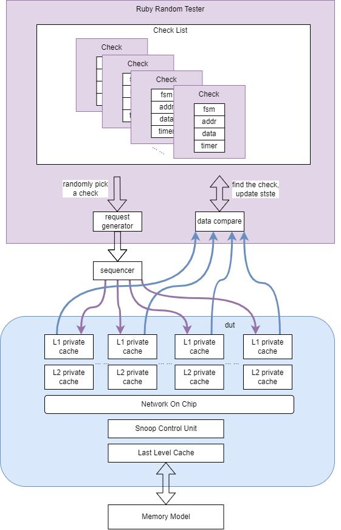

# OpenExSys_CoherentCache
OpenExSys_CoherentCache is a directory-based MESI protocol coherent cache IP.

## Getting Started

### Simulation

Currently, OpenExSys_CoherentCache uses *vcs* for simulation.

```sh
# set environment varibales
source env/sourceme
# go to the tb folder
cd tb/ruby_testbench
# Compile the sources, with a mesh configuration
make bld
# Run the simulation
make run
```

### Coherent Private Cache Architecture

For overall private cache specification, please refer to [Private Cache Architecture](./rtl/rvh_cache/doc/l1d_coherence.md).

For atomic operation specification, please refer to [Atomic Operation](./rtl/rvh_cache/doc/l1d_amo.md).

For store buffer specification, please refer to [Store Buffer](./rtl/rvh_cache/doc/l1d_stb.md)

### LLC and SCU Architecture

For last-level cache (LLC) and snoop control unit (SCU) specification, please refer to [LLC and SCU Architecture](./rtl/rvh_cache/doc/scu_coherence.md).


### Tester

The Ruby tester, a component of the gem5 Ruby coherence protocol, provides an automated testing framework that generates randomized memory accesses to test the correctness and performance of the coherence protocol. 
By simulating a variety of memory access patterns and conditions, the Ruby tester can help uncover subtle bugs and performance bottlenecks in the coherence protocol, allowing designers and researchers to improve the design and performance of their coherence protocols.

As it is illustrated in the following figure, the Ruby tester is a cache coherence verification
tool that aims to ensure the correctness of the cache coherence protocol implementation.
It achieves testing randomness by introducing several techniques, such as randomization
of check address initialization, random selection of checks to perform action and checks
at each cycle, and the use of finite state machines to control the check behavior.




We port the C++ based
Ruby random tester to SystemVerilog, in order to enable the use of the Ruby tester on
the RTL implementation.

## Publication

If you use OpenExSys in your work, you can cite us:

```
@inproceedings{fu2023cache,
  title={Cache Coherent Framework for RISC-V Many-core Systems},
  author={Fu, Zexin and Wang, Mingzi and Zhang, Yihai and Tan, Zhangxi},
  booktitle={Seventh Workshop on Computer Architecture Research with RISC-V (CARRV)},
  year={2023}
}
```
