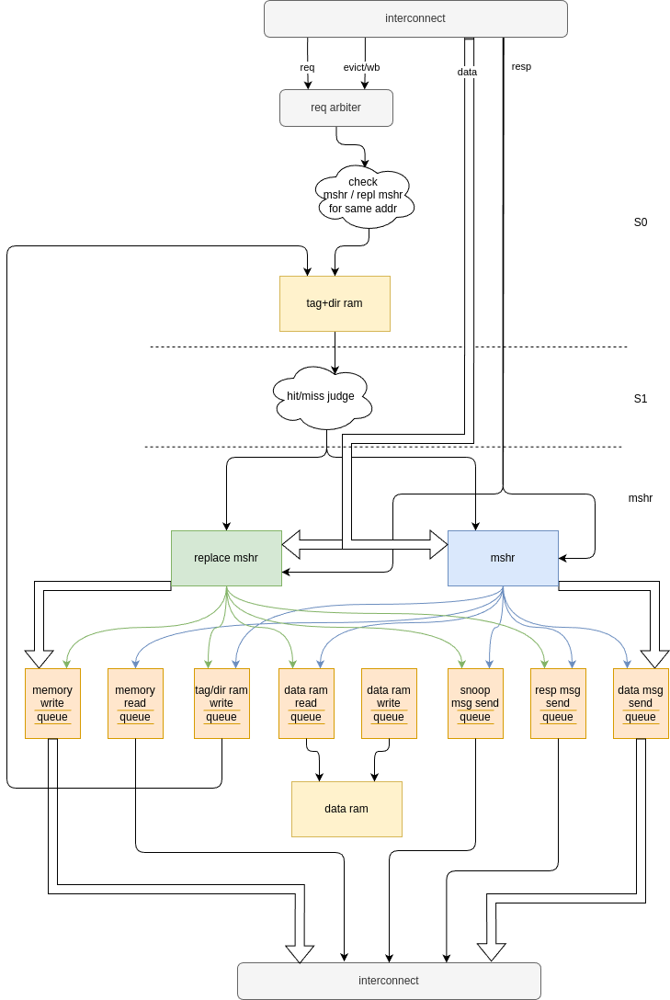
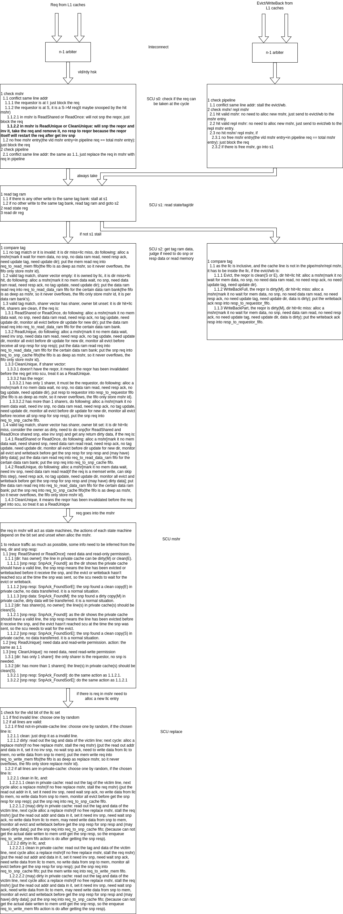

# scu coherence spec

The snoop control unit (SCU), and last-level cache (LLC) are integrated together. 
The LLC is designed to be inclusive with private caches, and the sparse directory to track cache line sharing information is integrated with the tag in LLC. 
This property provides several advantages, such as reduced latency and improved cache coherence. 
Additionally, the inclusion property can enable the SCU directory to merge with the LLC tag. 
This implies that a single tag entry in the LLC can represent both the valid and dirty state and coherence state for private caches. 
This also simplify the directory eviction invalidation by merging it with the LLC eviction invalidation to keep cache inclusion. 
This approach can reduce the complexity of cache coherence protocols and increase their efficiency by minimizing the number of coherence messages exchanged between caches.

The SCU is design based on the MSHR, each MSHR entry can operate its own FSM independently. 
In order to serialize some access to the critical resource like ram read and write and message sending, a lot of first in first out (FIFO) queues are employed, namely memory write queue, memory read queue, tag_directory ram write queue, data ram read queue, data ram write queue, snoop message send queue, response message send queue, data message send queue.
Although there are a lot of queues, they will not take a lot of extra storage because they only store MSHR id and replace-MSHR id, not the actully message and data it involves. 
Only when it is at the top of the FIFO queue, it will read the MSHR entry it points to, parse the MSHR's state and do corresponding pending action. 
This enables fine-grained control of all the critical resource and help SCU to improve resource utilization.

## Pipleline

### Overview

This figure illustrates the pipeline of SCU and LLC:

### Detail description

This figure provides a detailed description of each pipeline stage:

<object data="./scu_design_stages.drawio.pdf" type="application/pdf" width="700px" height="700px">
    <embed src="./scu_design_stages.drawio.pdf">
        
        

    </embed>
</object>